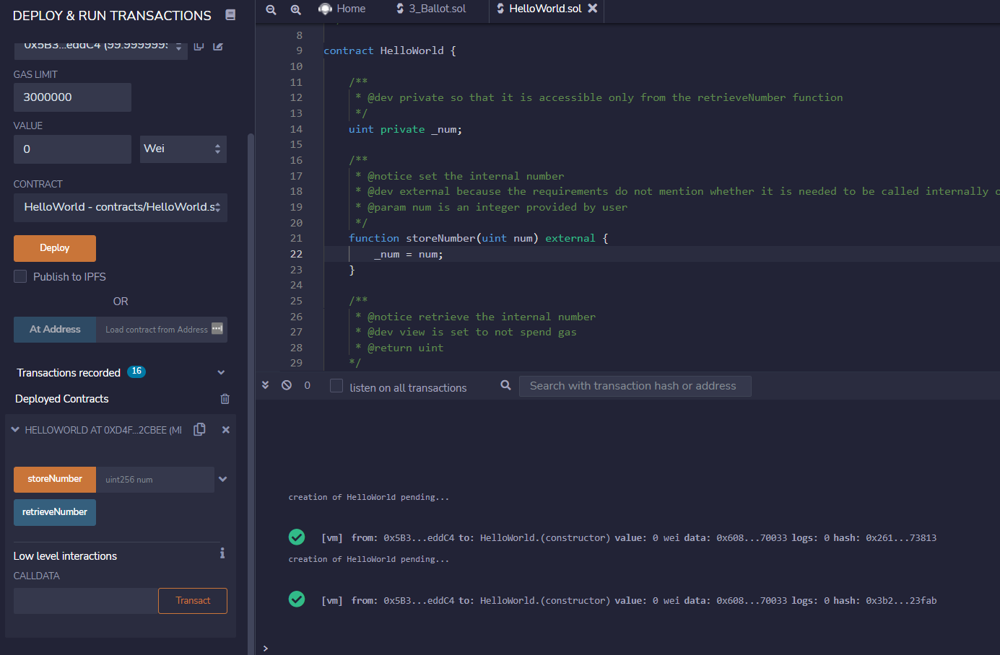

# ZKU Background Assignment

## Part A. Conceptual knowledge
> 1. What is a smart contract? How are they deployed? You should be able to describe how a smart contract is deployed and the necessary steps. 

A smart contract is like an app on a smartphone. An app on your phone is connected to the Internet, you can fill in some data and the app use those data to give you the result you want.A smart contract is also an app, but it is connected to another special kind of Internet (e.g. a blockchain) and it runs automatically everytime some conditions are met and nobody can interfere with its execution. Though, a blockchain is made by computers that speak their own language (called *bytecode*) - not comprehensible to humans -, so in order to install, or "*deploy*", a smart contract on it you need to write the smart contracts in a way (e.g. Solidity language) that can be translated to their language.  

> 2. What is gas? Why is gas optimization such a big focus when building smart contracts?

All the actions that can be performed by a smart contract have a cost. This is made for two reasons: the first, because running a computer on a blockchain is very expensive and so those who do it want to be payed for it, and second, you need to prevent people from using the smart contract in a wrong way that can damage other people.
Still, in order to allow people (who have good intentions) to use a smart contract, this cost cannot be too expensive. 
The cost of a smart contract is calculated based on how complex it is and how many things it does. So, it is very important to reduce the complexity of a smart contract as much as possible to reduce the cost, so that good people can use it.

> 3. What is a hash? Why do people use hashing to hide information?

A hash is a mathematical function that receives some data in input (of whatever the lenght) and it produces a single result that has a fixed lenght. If the data in input change, consequently the result will also change. 
Since this result is a mathematical representation of those data in input, and it is also uncomprehensible for humans, it is sometimes used to hide information because it is impossible to understand the original data.

> 4. How would you prove to a colorblind person that two different colored objects are actually of different colors? You could check out Avi Wigderson talk about a similar problem [here](https://www.youtube.com/watch?v=5ovdoxnfFVc&t=4s).

I would hand the two objects, in order, to the colorblind person and ask him to put them in two different places. Each place will have its own label that is different, depending on the order that I used to hand the objects to him. I cannot see those labels.
The colorblind person then would randomly pick one of those objects and I could tell him if it was the first or second object I handed to him. A mistake from me would mean that I could not recognize the order, which means that the objects have likely the same color (because I can see them).

## Part B. You sure you’re solid with Solidity?
> 1. Program a super simple “Hello World” smart contract: write a storeNumber function to store an unsigned integer and then a retrieveNumber function to retrieve it. Clearly comment your code. Once completed, deploy the smart contract on remix. 

```solidity
/ SPDX-License-Identifier: MIT
pragma solidity >=0.7.0 <0.9.0;

/** 
 * @title HelloWorld
 * @notice Simple contract
 */

contract HelloWorld {
   
    /**
     * @dev private so that it is accessible only from the retrieveNumber function.
     */
    uint private _num; 

    /**
     * @notice set the internal number
     * @dev external because the requirements do not mention whether it is needed to be called internally or not.
     * @param unsigned integer provided by user
     */
    function storeNumber(uint num) external {
        _num = num;
    }

    /** 
     * @notice retrieve the internal number
     * @dev view is set to not spend gas
     * @return uint 
    */ 
    function retrieveNumber() external view returns(uint) {
        return _num;
    }
}
```
### Screenshots
Deployed on Remix



> 2. On the documentation page, the “Ballot” contract demonstrates a lot of features on Solidity. Read through the script and try to understand what each line of code is doing.

Ballot.sol shows the following key points:

- the usage of `payable` address
- the usage of `mapping` to have a hashmap with key -> value relationship
- how to create custom `event` to be used when some operations are performed
- how to use a `constructor` (initialized at deployment time)
- how to retrieve the current time in Solidity with `block.timestamp` (`now` seems to be deprecated)
- how to use the `memory` keyword to create in memory storage
- how to use function keywords such as `external` (to make the function visible only from outside the smart contract), `internal` (only visible inside and inherited contracts) or `pure` (it does not read or write any variable of the contract) 
- how to use `msg.sender` to retrieve the Ethereum address that called the smart contract and `msg.value` to retrive the amount of ether sent by the caller 
- how to use a for loop and if statement
- how to use `require` to check if some conditions are true and throw an error in case they are not
- hwo to use `selfdestruct` to destroy the contract
- how to use arrays

> 3. Suppose we want to limit the voting period of each Ballot contract to 5 minutes. To do so, implement the following: Add a state variable startTime to record the voting start time. Create a modifier voteEnded that will check if the voting period is over. Use that modifier in the vote function to forbid voting and revert the transaction after the deadline.

Code modified ([read full code](contracts/Ballot.sol)):
```solidity

contract Ballot {
    ...
    ...
    // declare the variable
    uint private startTime;

    constructor(bytes32[] memory proposalNames) {
        chairperson = msg.sender;
        voters[chairperson].weight = 1;

        for (uint i = 0; i < proposalNames.length; i++) {
            // 'Proposal({...})' creates a temporary
            // Proposal object and 'proposals.push(...)'
            // appends it to the end of 'proposals'.
            proposals.push(Proposal({
                name: proposalNames[i],
                voteCount: 0
            }));
        }
        // instantiate the variable at deployment time
        startTime = block.timestamp;
    }

    // create the modifier
    modifier voteEnded(){
        if(block.timestamp > uint32(startTime + 5 minutes)) {
            revert("Voting time is expired.");
        }
        _;
    }

    // use the modifier
    function vote(uint proposal) public voteEnded {
        ...
    }
```
> 4. Deploy your amended script and test the newly implemented functionality in part 3. Submit (1) your amended version of the contract on Github or Gist and (2) screenshots showing the time of contract deployment as well as the transaction being reverted once past the voting period.

[Amended version](contracts/Ballot.sol)
### Screenshots
**Deployment successful**
 

**Voting time expired**
